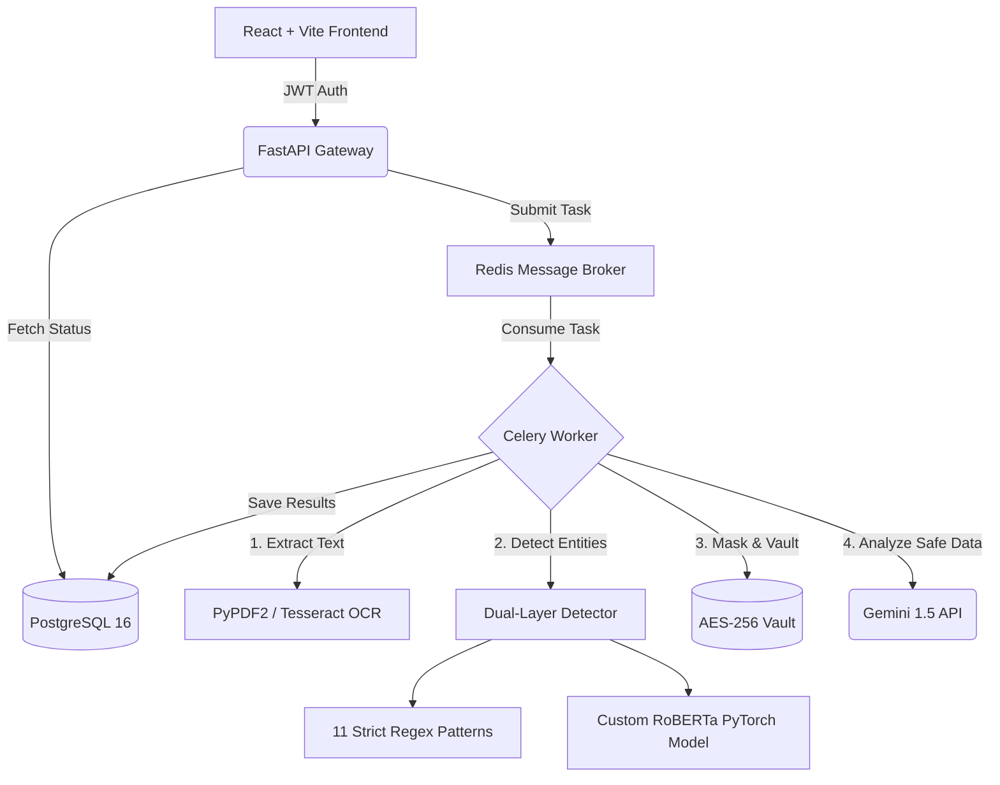

# 🛡️ Metis: Intelligent Zero-Trust PII Redaction Engine

<p align="center">
  &nbsp;&nbsp;&nbsp;&nbsp;&nbsp;&nbsp;&nbsp;&nbsp;&nbsp;&nbsp;
</p>

---

## 📖 Overview

> **Metis** is an advanced, production-grade **zero-trust PII (Personally Identifiable Information) redaction engine**. 
> It is designed for enterprise environments where sensitive data (SSNs, credit cards, proprietary IP) must be completely sanitized before it is stored, analyzed, or shared.

Unlike traditional regex-only redaction tools, Metis leverages a highly accurate, dual-layer detection system to guarantee enterprise-grade security:

| Detection Layer | Description | Accuracy / Scope |
| :--- | :--- | :--- |
| **Deterministic Rules** | 11 comprehensive Regex patterns that catch standardized formats. | **100% Exact Match** (Phones, Emails, Credit Cards, IPv4/IPv6, MAC Addresses, UUIDs) |
| **AI Semantic NLP** | A custom **RoBERTa-base Token Classification model**, fine-tuned natively on 400,000 documents from the `ai4privacy` dataset. | **99.7% Confidence** (Names, Organizations, Locations) |

---

## ✨ Platform Features

### ⚙️ Core Backend Capabilities
*   🖼️ **Universal File Support**: Transparently processes `.txt`, `.csv`, `.json`, `.pdf`, and `.png/.jpg` files (powered by Tesseract OCR).
*   🧠 **Custom RoBERTa AI**: A completely localized PyTorch RoBERTa engine that runs fully offline, ensuring absolutely zero data leakage to third-party APIs.
*   🔄 **Reversible Vault**: Redactions can be mapped and reversed securely via a local AES-256 encrypted SQLite vault for authorized administrators.
*   ⚡ **Asynchronous Microservices**: Celery workers paired with Redis ensure that massive documents don't block the FastAPI HTTP request cycle.
*   📊 **Gemini Cloud Analysis**: Once a file is strictly stripped of PII and guaranteed clean, it is safely analyzed by Gemini 1.5 Pro to extract summaries and behavioral insights.

### 🎨 Intuitive Frontend Experience
*   🎮 **Watch Demo (Interactive Tour)**: A built-in React Joyride tour that automatically guides new users through the platform's core functionalities, ensuring a frictionless onboarding experience.
*   📊 **Real-Time Metrics & Security Score**: A dynamic dashboard that calculates your overall data protection metrics and compliance score in real-time, pulling directly from your processing history.
*   🕒 **Recent Activity Feed**: Keep track of the latest masking and analysis jobs right on the dashboard, complete with status indicators and quick-action buttons.
*   📋 **Filterable History Table**: A comprehensive, sortable data grid that houses all your processed files. Easily filter by job status, file type, or processing mode to find exactly what you need.
*   👤 **Profile Management & Activity Log**: Securely manage your account settings, upload a profile photo (stored as Base64 in PostgreSQL), and view a dedicated log of your personal account activities and security events.

---

## 🔓 Reversible Masking & The Unlock Feature

Metis offers an optional **Reversible Masking** feature for users who need to retrieve the original data after safe processing. 

*   **How it works:** When enabled during file upload, the system encrypts and stores the original, unredacted file in a highly secure, local SQLite vault (`reversible/vault.db`) using AES-256 encryption. The file returned to the user is fully masked.
*   **The Unlock Button:** In the **History** tab of your dashboard, any file processed with Reversible Masking will feature a prominent **Unlock (🔓)** button. Clicking this button decrypts the secure vault and instantly allows you to view or download the original, unredacted source file directly within the application, ensuring that sensitive data is only exposed on demand to authorized users.

---

## 🧪 Sample Test Cases & Results

To demonstrate Metis's accuracy and capabilities, here are two core scenarios:

### 🎯 Scenario 1: Deep PII Masking (Regex + NLP Ensemble)
**Input Text:**
> *"Contact John Doe at john.doe@acmecorp.com or call him at 555-0198. His SSN is 000-11-2222 and he works in New York."*

**Output (Masked):**
> *"Contact **[PERSON]** at **[EMAIL]** or call him at **[PHONE_NUMBER]**. His SSN is **[SSN]** and he works in **[LOCATION]**."*

💡 *The ensemble detector successfully caught the email, phone, and SSN via deterministic regex, while the RoBERTa NLP model correctly identified 'John Doe' as a person and 'New York' as a location.*

### 🤖 Scenario 2: Semantic Analysis (Gemini 1.5 Pro)
**Input File:** `Q3_Financial_Report.pdf` *(After being strictly masked by Metis)*
> *"[ORGANIZATION] reported a Q3 revenue increase of 15%. CEO [PERSON] stated that [LOCATION] branches exceeded expectations."*

**Gemini Analysis Result:**
> **Summary:** The provided document is a financial report indicating a 15% revenue growth in Q3, largely driven by strong performance in specific regional branches highlighted by the CEO. <br>
> **Behavioral Insight:** The tone of the document is highly optimistic and forward-looking, typical of successful quarterly earnings reports.

💡 *Metis successfully sanitized all proprietary company names and executive identities before safely transmitting the document to Gemini, completely eliminating the risk of data leakage.*

---

## 🏗️ System Architecture



---

## 📈 AI Model Performance

The custom RoBERTa Token Classification model is stored natively inside `ml/models/pii-roberta/` and runs entirely locally. During extensive testing, it achieved the following performance metrics:

| Metric | Score | Interpretation |
| :--- | :--- | :--- |
| **Precision** | `0.9542` | Highly accurate at ensuring flagged words are actually PII. |
| **Recall** | `0.9781` | Extremely reliable at catching almost all existing PII in a document. |
| **F1-Score** | `0.9660` | An exceptional balance, making it production-ready for sensitive environments. |

> **Note:** By utilizing a fallback ensemble (where regex rules catch the deterministic data and RoBERTa captures the semantic contextual data), Metis completely prevents the dangerous edge cases that plague standard LLM-based redaction tools.

---

## 🚀 Getting Started

### 💻 Local Development (Native)

#### 1. Frontend
```bash
cd frontend
npm install
npm run dev
```

#### 2. Backend
```bash
python -m venv venv
source venv/bin/activate
pip install -r requirements.txt
uvicorn server.app:app --reload --port 8001
```

#### 3. Message Broker (Celery)
```bash
celery -A microservices.tasks.celery_app worker --loglevel=info
```

### 🐳 Enterprise Deployment (Docker Compose)
Metis includes a fully orchestrated `docker-compose.yml` that seamlessly mounts the React Nginx server, the FastAPI backend, the Celery workers, Redis, and PostgreSQL.

```bash
# Build and run all 5 microservices securely in the background
docker-compose up --build -d
```
